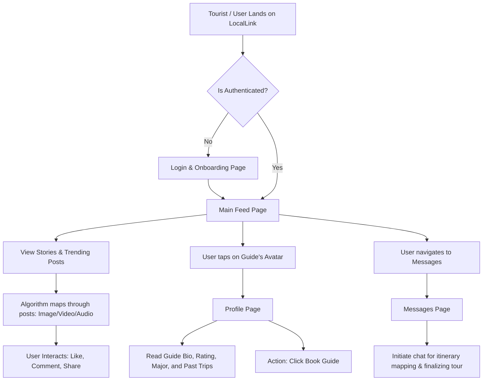

# LocalLink 🌍

**Discover cities through local eyes.**

LocalLink is a unique social media and gig-economy platform designed specifically for college students (like B.Tech students) who want to earn a part-time income serving as local tour guides. It bridges the gap between tourists looking for authentic native experiences and students who intimately know their city's hidden gems.

---

## 1. Project Information: What is it? ("Project Kya Hai")

Many college students do part-time jobs to support themselves, but often these jobs lack flexibility or good pay. At the same time, when tourists visit a new city, they struggle to find authentic local experiences away from commercialized tourist traps.

**LocalLink** gives students a platform to become content creators and local tour guides. 
- **For Guides (Students):** They create and share multimedia content (Images, Audio clips, Videos) about local spots, hidden cafes, and heritage sites. 
- **For Tourists:** They consume this content on a social feed, follow their favorite local student guides, message them directly, and book them for guided tours at a set hourly rate.

---

## 2. Technical Implementation: How and What We Made ("What & How We Make It")

We built a modular, responsive Single Page Application (SPA) using a modern web development stack. The architecture is designed to be mobile-first, mimicking the fluid experience of native social media apps like Instagram or Twitter.

### Core Technologies Used 💻
- **Frontend Framework:** React 19 (Functional Components & Hooks)
- **Build Tool:** Vite (For lightning-fast HMR and optimized builds)
- **Language:** TypeScript (Ensures strict type-checking, reducing runtime bugs)
- **Routing:** React Router v6 (Client-side routing across Feed, Profile, Messages, and Login)
- **Styling:** Tailwind CSS v4 (Utility-first framework for pixel-perfect, responsive design)
- **Icons:** Lucide React (Clean, consistent SVG icon set)
- **Deployment Strategy:** Optimized for CI/CD environments like **Vercel**.

### Key Architectural Decisions
- **Mock Data Engine:** Instead of standing up a complex backend immediately, we designed rigorous TypeScript interfaces (`Guide`, `Post`, `Story`, `Chat`) and created a simulated database (`data.ts`). This allows seamless transitioning to a real backend (like Firebase/Node.js) later.
- **Dynamic Media Rendering:** The `PostCard` component algorithmically determines its layout and UI controls based on the content `type` (`image`, `video`, `audio`), providing customized viewing experiences (e.g., audio scrubbers, video play buttons).
- **Client-Side State Management:** Used React `useState` to handle local interactions (like toggling comments and liking posts) instantaneously without network latency.

---

## 3. Algorithm & System Flow Chart 🔄

The application follows a standard social-commerce state flow.

### User Journey Flowchart (Mermaid)
If you view this on GitHub, it will automatically render into a visual flowchart.

### Logical Abstraction Flow
1. **Bootstrap Phase:** `main.tsx` mounts the React tree, applying global Tailwind styles from `index.css`.
2. **Routing Phase:** `App.tsx` initializes `BrowserRouter`. It checks the current URL path to conditionally render navigation bars.
3. **Data Injection Phase:** `FeedPage.tsx` and `ProfilePage.tsx` pull records from the data layer (`mockGuides`, `mockPosts`).
4. **Rendering Phase:** The UI maps over data arrays to generate isolated `PostCard` instances. Each instance maintains its own interaction state (likes, comment visibility).
